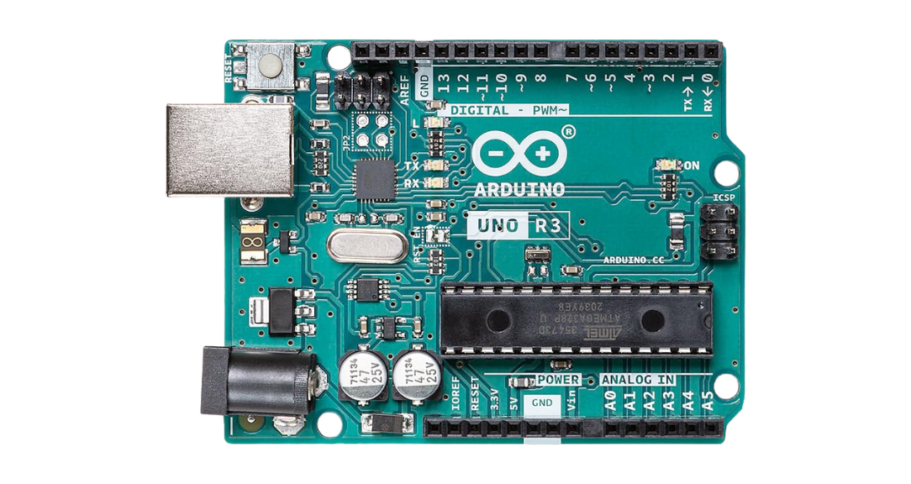
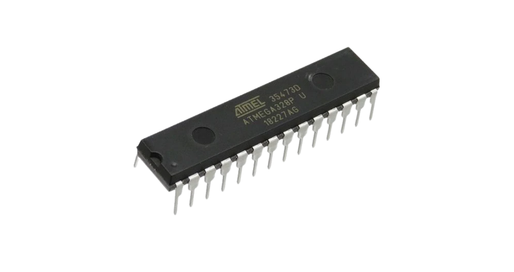

# Arduino UNO (ATmega328P) - Bare-Metal

A collection of bare-metal Arduino UNO R3 projects designed to help you get started in embedded systems by programming the ATmega328P directly at register level, without Arduino abstractions.

<p align="center">
  
  &nbsp;&nbsp;
  
</p>

This repository follows an incremental approach. Each project builds on the previous one, adding new peripherals and concepts progressively. You can navigate to any project using git tags and find the complete state up to that point.

```bash
# Example: checkout the start-here project
git checkout 00-start-here
```

## Requirements

**Hardware:**
- Arduino UNO (or compatible ATmega328P board).
- USB cable (Type A to Type B).
- Jumper wires and a breadboard (for external circuits).

**Software:**
- avr-gcc (AVR toolchain).
- avrdude (for flashing).
- make (from project 13 onward).
- A terminal and VS Code.

**Knowledge:**
- Basic C programming.
- Comfortable using the terminal.

## Documentation

Keep these open while working through the projects. You will reference them constantly.

**ATmega328P Datasheet** (Microchip)
- The main reference for registers, peripherals, memory map and electrical specs.
- [docs/ATmega328P-datasheet.pdf](docs/ATmega328P-datasheet.pdf)

**Arduino UNO R3 Datasheet**
- Board-level reference: power, pin mapping and electrical characteristics.
- [docs/Arduino-UNO-datasheet.pdf](docs/Arduino-UNO-datasheet.pdf)

**Arduino UNO R3 Pinout**
- Quick visual reference for pin mapping between the ATmega328P and the board headers.
- [docs/Arduino-UNO-pinout.pdf](docs/Arduino-UNO-pinout.pdf)

## Projects

This collection grows project by project. Each entry links to a brief description of what you will learn.

| # | Topic | Tag |
|---|-------|-----|
| 00 | Toolchain setup and Blinky | `00-start-here` |

## Getting Started

1. Clone the repository:

```bash
git clone https://github.com/miguelsergio/arduino-uno-bare-metal.git
cd arduino-uno-bare-metal
```

2. List all available projects:

```bash
git tag -l "[0-9]*"
```

3. Checkout a specific project:

```bash
git checkout 00-start-here
```

4. Follow the instructions in the README for that project's tag.

## License

This project is licensed under the MIT License. See [LICENSE](LICENSE) for details.
