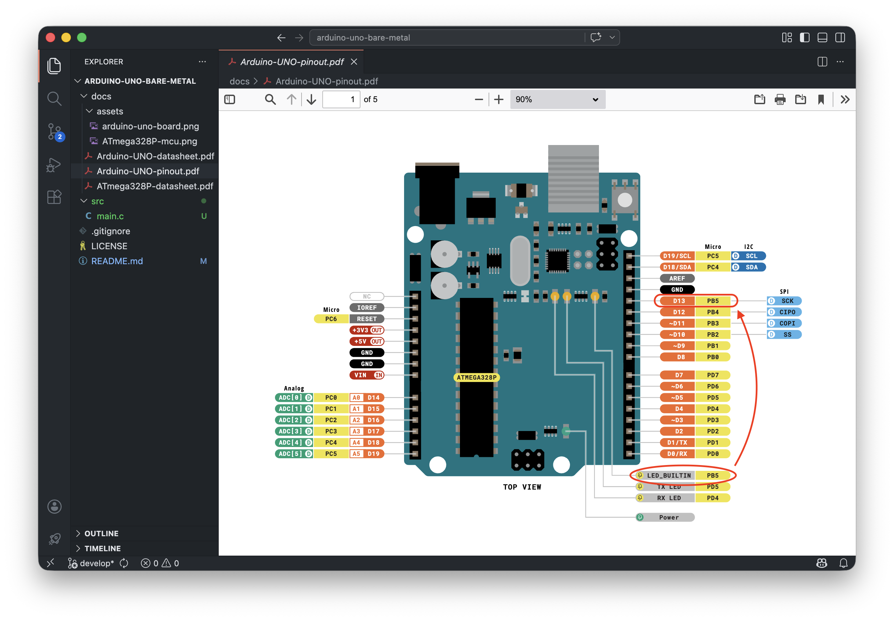
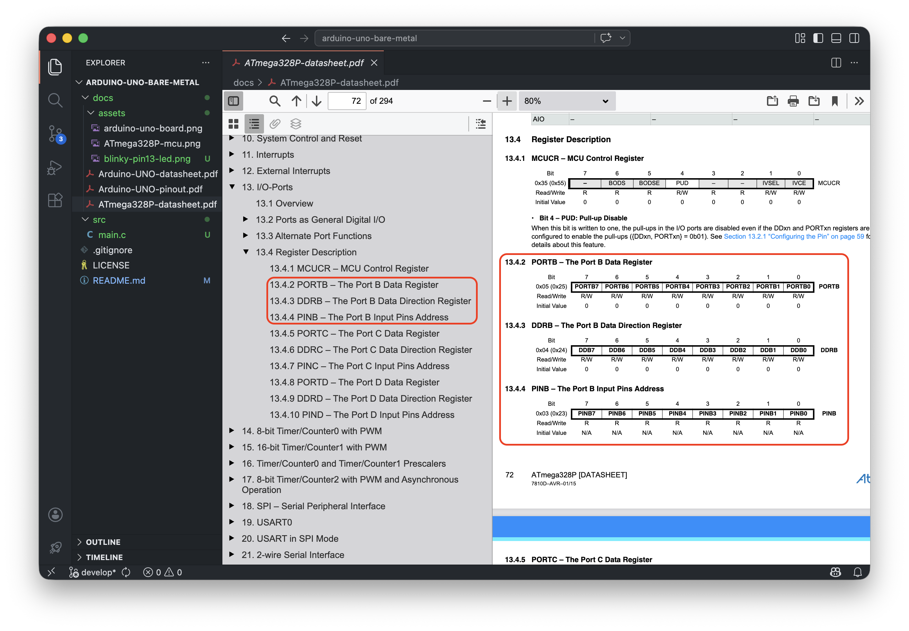

# Start Here - Toolchain Setup and Blinky

Your first bare-metal project. No Arduino library, no abstractions. Just C, registers and the ATmega328P datasheet.

By the end of this project you will know how to install the AVR toolchain, compile a C program manually, flash it to the board and control a GPIO pin at register level.

---

## What you will learn

- How to install the AVR toolchain on your machine.
- What registers are and how to read them from the datasheet.
- How to configure a GPIO pin as output.
- How to compile and flash a bare-metal program manually.

---

## Part 1 - Toolchain Setup

You need two tools: a cross-compiler for AVR and a flash programmer.

- **avr-gcc**: the C compiler for AVR microcontrollers.
- **avrdude**: the tool that sends your program to the board over USB.

**macOS:**

```bash
brew tap osx-cross/avr
brew install avr-gcc avrdude
```

**Linux (Debian/Ubuntu):**

```bash
sudo apt update
sudo apt install gcc-avr avrdude
```

**Windows (native):**

Install [MSYS2](https://www.msys2.org), then open the MSYS2 UCRT64 terminal and run:

```bash
pacman -S mingw-w64-ucrt-x86_64-avr-gcc mingw-w64-ucrt-x86_64-avrdude
```

All commands in this project must be run from the MSYS2 UCRT64 terminal.

Verify the installation:

```bash
avr-gcc --version
avrdude -v
```

---

## Part 2 - Blinky

The classic first embedded program. Toggle the built-in LED on and off every 500 ms.

The built-in LED on the Arduino UNO R3 is connected to **pin 13**, which maps to **PB5** (Port B, bit 5) on the ATmega328P.



Open the ATmega328P datasheet and find the **I/O-Ports** chapter. You will see three registers for each port:

- **DDRx**: Data Direction Register. Controls whether a pin is input (0) or output (1).

- **PORTx**: Output register. Sets a pin HIGH (1) or LOW (0) when configured as output.

- **PINx**: Input register. Reads the current state of a pin.



To blink the LED on PB5:
1. Set bit 5 of DDRB to 1 (configure PB5 as output).
2. Set bit 5 of PORTB to 1 (LED ON).
3. Wait 500 ms.
4. Clear bit 5 of PORTB to 0 (LED OFF).
5. Repeat.

**The code:**

```c
/* ATmega328P register addresses */
#define DDRB   (*(volatile unsigned char *)0x24)
#define PORTB  (*(volatile unsigned char *)0x25)

/* Busy-loop delay: wastes CPU cycles to approximate a delay in ms.
 * 800 is the closest value found visually for 1 ms at 16 MHz.
 * A timer-based delay will replace this in a later project. */
static void delay_ms(unsigned int ms) {
    for (unsigned int i = 0; i < ms; i++) {
        for (volatile unsigned int j = 0; j < 800; j++);
    }
}

int main(void) {
    DDRB |= (1U << 5); /* PB5 as output */

    while (1) {
        PORTB |= (1U << 5); /* LED ON  */
        delay_ms(500);

        PORTB &= ~(1U << 5); /* LED OFF */
        delay_ms(500);
    }

    return 0;
}
```

**Understanding the implementation:**

`#define DDRB (*(volatile unsigned char *)0x24)` - maps the name DDRB to memory address 0x24, which is where the ATmega328P stores Port B's direction register. The `volatile` keyword tells the compiler this memory can change at any time (hardware writes it), so it must never cache or optimize it away. The cast to `unsigned char *` and the dereference `*` let you read and write it like a regular variable.

`DDRB |= (1U << 5)` - read-modify-write pattern. It sets bit 5 without touching the other bits in DDRB. Never assign directly (`DDRB = (1U << 5)`) unless you intend to configure all 8 pins at once.

`PORTB |= (1U << 5)` - sets bit 5 HIGH (LED ON). Same read-modify-write pattern.

`PORTB &= ~(1U << 5)` - clears bit 5 LOW (LED OFF). The `~` operator inverts the mask so only bit 5 is cleared, leaving the rest untouched.

`delay_ms()` - wastes CPU cycles to approximate a delay in ms. 800 is the closest value found visually for 1 ms at 16 MHz. A timer-based delay will replace this in a later project.

---

## Compile

From the project root, run these commands:

```bash
# 1. Compile to ELF
avr-gcc -mmcu=atmega328p -Os -o main.elf src/main.c

# 2. Convert ELF to HEX (the format avrdude expects)
avr-objcopy -O ihex main.elf main.hex
```

- `-mmcu=atmega328p`: target MCU.
- `-Os`: optimize for size.

---

## Flash

Connect the Arduino UNO via USB. Find the serial port:

**macOS:**

```bash
ls /dev/tty.usbmodem*
```

**Linux:**

```bash
ls /dev/ttyACM*
```

**Windows:**

Open Device Manager and look under **Ports (COM & LPT)**. You will see something like `USB Serial Device (COM3)`.

Then flash:

```bash
avrdude -c arduino -p atmega328p -P /dev/tty.usbmodemXXXX -b 115200 -U flash:w:main.hex
```

Replace `/dev/tty.usbmodemXXXX` with your actual port. On Linux use `/dev/ttyACM0`. On Windows use `COMX` (e.g. `COM3`).

The built-in LED should start blinking once flashing is complete.
